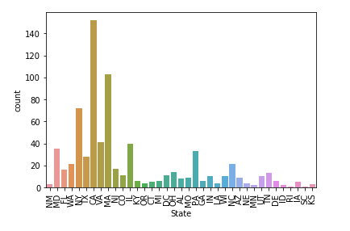
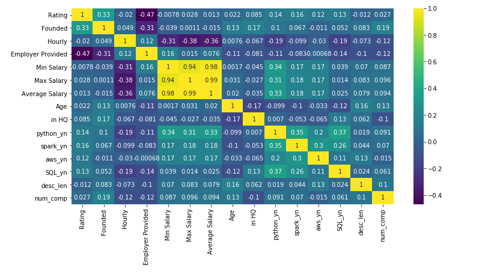
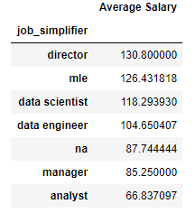

# Glassdoor Data Science & Machine Learning Project
- Developed a tool that will predict the salaries of Data Scientists (MAE ~ 11k). This was intened to help data scientists negotiate salaries during their job hunt.
- Utilized Python and Selenium to scrape 1000 job description from glassdoor, you can find the code [here](https://github.com/jason-huynh83/Glassdoor_Salary_Predictions/blob/master/glassdoor_scraper.py)
- [Data cleaning](https://github.com/jason-huynh83/Glassdoor_Salary_Predictions/blob/master/data_cleaning.py) and feature engineering to create the model 
- Exploratory Data Analysis [EDA](https://github.com/jason-huynh83/Glassdoor_Salary_Predictions/blob/master/Exploratory%20Data%20Analysis.ipynb) to grasp a better understanding and visualize the data
- Several machine learning algorithms were utilized to test and evaluate the model predictions, and can be found [here](https://github.com/jason-huynh83/Glassdoor_Salary_Predictions/blob/master/Model%20Building.ipynb)
  - Multiple Linear Regression
  - Lasso Regression
  - Random Forest Regression
  
# Code and Resources Used
- Python: Version 3.8
- Packages: pandas, numpy, sklearn, matplotlib, seaborn, selenium
- Scraper Github: https://github.com/arapfaik/scraping-glassdoor-selenium
- Scraper Article: https://towardsdatascience.com/selenium-tutorial-scraping-glassdoor-com-in-10-minutes-3d0915c6d905
  
# The Dataset
- The scraper utilized for this project scarped the following info:
  - Job Title: the job title
  - Salary Estimate: Glassdoor's Salary Estimate
  - Job Description: The job description
  - Rating: The company's rating
  - Comapny Name: The company's name
  - Location: The location of the company
  - Headquarters: The location of the headquarters of the company
  - Size: Size of company (employees)
  - Founded: When the company was founded
  - Type of ownership: The ownership of the company
  - Industry: What industry the company is in
  - Sector: What sector the company is in
  - Revenue: The revenue the company brings in
  - Competitors: The competitors the company has

# Data Cleaning
This part of the project involved some data cleaning in order for the machine learning model to be able to read the data
- Parsed out salary estimates
- Determined the Age of each company
- Parsed out Company Name from 'Ratings'
- Parsed out State from Location
- Feature engineered for categorizing seniority in the company
  - Junior
  - Seniors
  - other
- Feature engineered for cateogorizing job titles into 5 different categories
  - data scientists
  - analysts
  - mle (machine learning engineers)
  - data engineer
  - managers
  - directors
  - na
- Feature engineered for companys that:
  - were located in the same location as their headquarters
  - had 'python' in the job description
  - had 'spark' in the job description
  - had 'aws' in the job description
  - had 'SQL' in the job description
  
# Exploratory Data Analysis (EDA)
Please view the EDA notebook in nbviewer [here](https://nbviewer.jupyter.org/github/jasonhuynh83/Glassdoor_Salary_Predictions/blob/master/Exploratory%20Data%20Analysis.ipynb)

Develop many visuals in order to understand and visualize the data better, below are some highlights:
 

# Model Building 
For this model, we will use the following machine learning algorithms:
- Multiple Linear Regression
- Lasso Regression
- Random Forest Regression

The data was split using a train-test-split into 30% of the dataset dedicated for the test set and 70% dedicated for the training set. All three models were evaluated using MAE (mean absolute errors)

# Model Evaluation
The Random Forest Regression performed the best at a MAE: ~11.
- **Multiple Linear Regression MAE:**  18.639299060909213
- **Lasso Regression MAE:**  19.346117533529366
- **Random Forest Regression MAE:**  11.579253312945974

# Conclusion
From the evaluation we can see that the Lasso Regression Model scores the worst at around 19. This is interesting as I assumed the Lasso would at least perform better than the multiple linear regression as Lasso would help with multicollinearity issues. However, it seems that the Lasso model most likely overfits the training set and thus, a higher error in the test set.

The Random Forest Regressor performs the best with a MAE with around 11. In other words, using the Random Forest Regressor, we are around 11k off in salary predictions.

